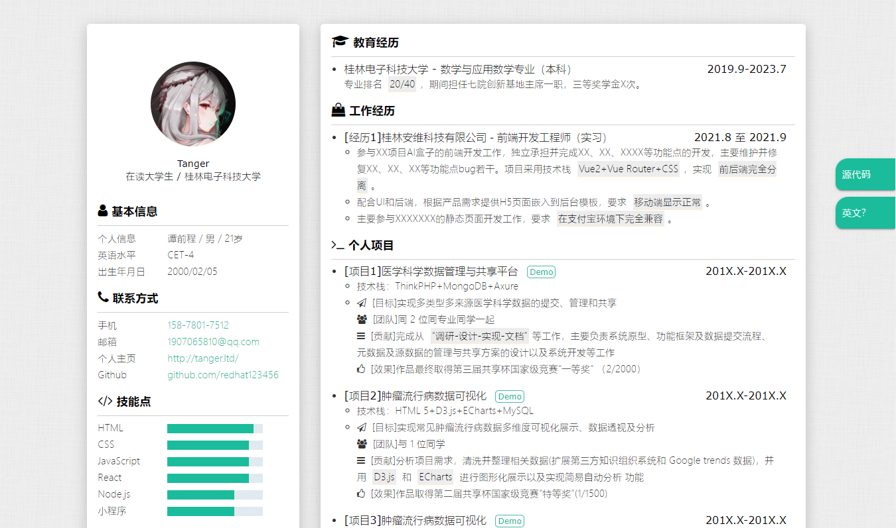
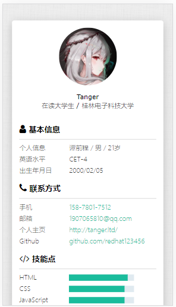

# 个人简历模板

[https://github.com/redhat123456/resume](https://github.com/redhat123456/resume)

预览：[http://tanger.cloud/resume](http://tanger.cloud/resume)

## Intro

此简历模板：

- 内容上，来源于我本人真实求职经历以及参加多次网上简历培训总结而成
- 风格上，参考众多简历风格，@张大侠, 以及~~我自己的 Hexo 主题 [hexo-theme-MiHoYo](https://github.com/redhat123456/hexo-theme-MiHoYo)~~

欢迎提 issue 或者 star，ღ( ´･ᴗ･` )比心

## Object

前端求职/程序员求职

## Usage

1. 先 Star/Fork 本项目，然后 Clone 或者直接下载到本地
2. 修改 index.html 内相关信息
3. 微调样式（作为前端求职，这点应该不成问题）
4. 生成 pdf(开发中)
5. 部署到线上
6. 生成访问二维码（开发中）
7. 祝您求职成功！

## Preview

### PC 端

### 移动端

## TODO

- [ ] 输出 pdf 功能
- [ ] 可编辑

## Acknowledgments

- font-awesome 提供字体图标

## At Last

最后的最后如果喜欢的话不妨给个小小的 Star ， 支持一下开发者！！🎃
